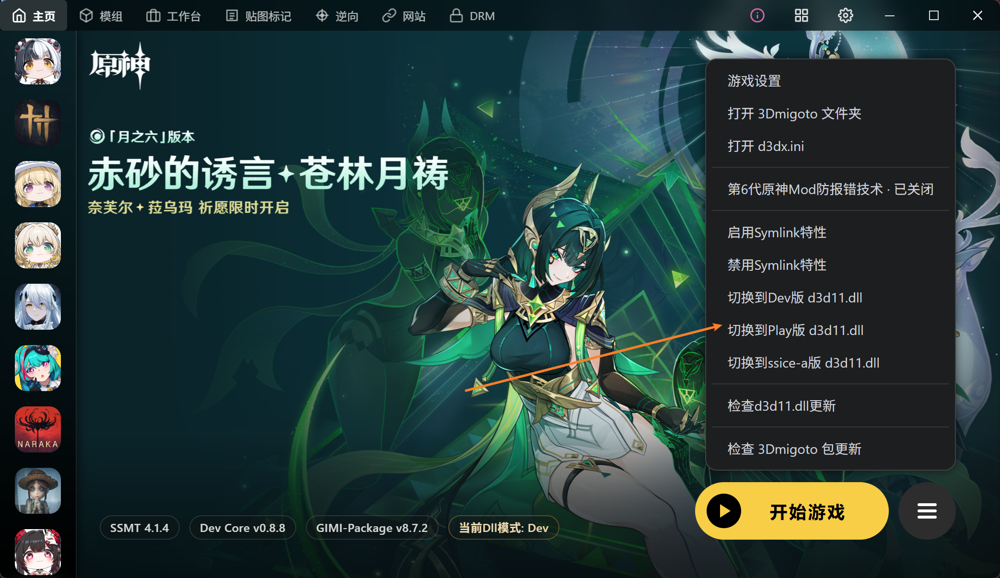
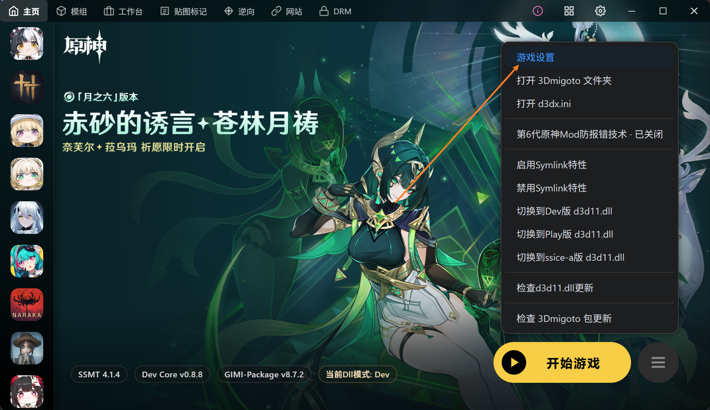
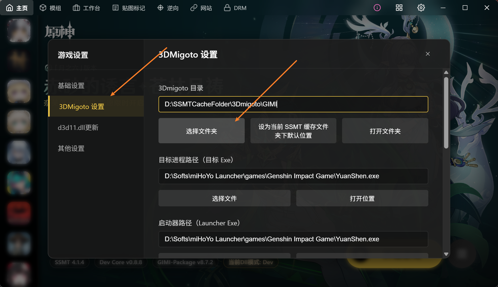
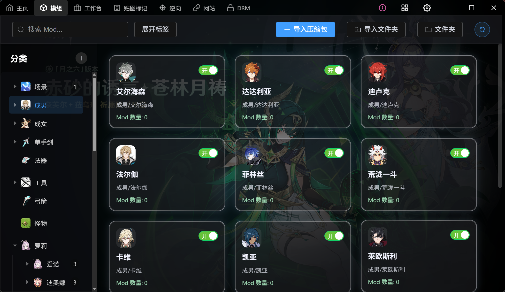

# SSMT4如何解决10612-4001等报错

最近一次更新日期:2026-05-12 20:42

仍然完美解决报错，可危战，可千星。

## 解决方案

直接开启`第六代原神Mod防报错`选项即可：

注意：
1.此功能需要卸载所有杀软类软件（杀软会误报或拦截权限）
2.需要管理员启动SSMT才能使用，否则权限不足。

## 为啥还是报错？
偶尔会因为dll广泛传播问题导致部分电脑短暂无法使用，切换到Play版dll即可。

## 我换成SSMT之后难道Mod要一个一个重新安装吗？

不用，你游戏设置里，3Dmigoto文件夹选到你之前自己的3Dmigoto文件夹即可

3Dmigoto文件夹里必定包含d3dx.ini，别选错了

不嫌麻烦也可以直接用SSMT的目录，然后一个一个安装Mod

## SSMT有Mod管理吗？

有的，而且很好用，自己去摸索一下或者问群友：

觉得哪里不好用可以反馈给我修改

> 由于公开会导致很快失效，仅提供LTS技术支持群友使用，可在如下赞助链接中获取，
> 之前激活过的无需重复激活，下载最新版SSMT4直接使用即可
> 
> https://afdian.com/item/ec74ee782b2f11efb5a052540025c377

## 核心原理

由于机制一旦公开，原神那边就会立刻更新来补上，部分同类工具也会直接照抄导致大范围传播后失效，
所以部分特殊电脑环境，如果按照上述操作仍然无法解决报错问题的话，在LTS群内的兄弟们，直接联系我1对1 QQ远程桌面即可，我直接用隐藏技巧帮你配置好。

