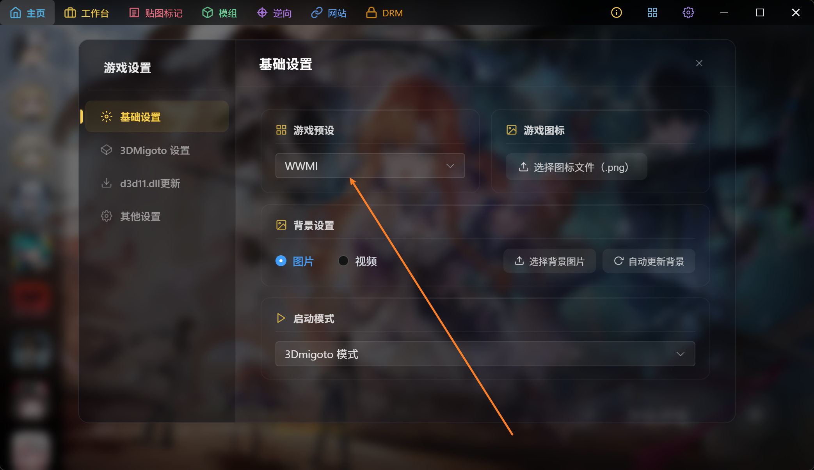
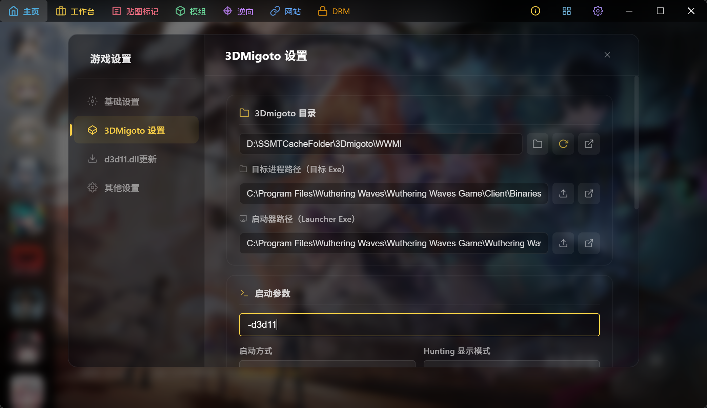
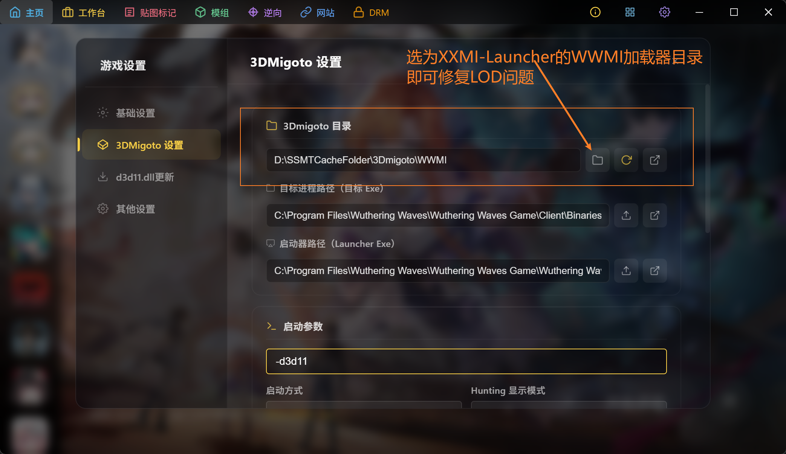

# ⚙️ 鸣潮如何正确配置实现一键启动

游戏预设选择 `WWMI`

目标进程路径 `C:\Program Files\Wuthering Waves\Wuthering Waves Game\Client\Binaries\Win64\Client-Win64-Shipping.exe`
(换成你自己的Client-Win64-Shipping.exe)

启动器路径 `C:\Program Files\Wuthering Waves\Wuthering Waves Game\Wuthering Waves.exe`
(换成你自己的Wuthering Waves.exe)

启动参数 `-d3d11`

注意：由于SSMT并未维护用于修复鸣潮多级LOD的引擎ini文件，所以使用SSMT自带的3Dmigoto启动鸣潮会导致缺少LOD对应修复，导致角色界面和大世界的贴图Hash不同

要解决此问题建议SSMT结合XXMI-Launcher一起使用，只要把3Dmigoto目录选到XXMI根目录下的WWMI目录即可（也就是说你至少得用XXMI-Launcher启动一次WWMI，配置好引擎ini后才能使用SSMT一键启动，实战推荐使用XXMI-Launcher启动鸣潮、SSMT仅用于Mod制作）：

此外，目前SSMT4 + TheHerta4可完美制作鸣潮Mod，遇到问题记得给我留言。