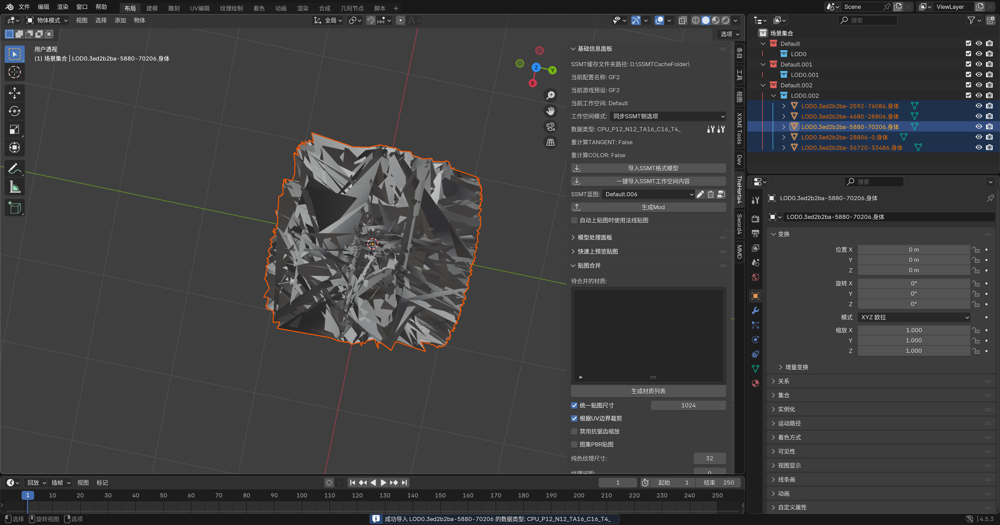
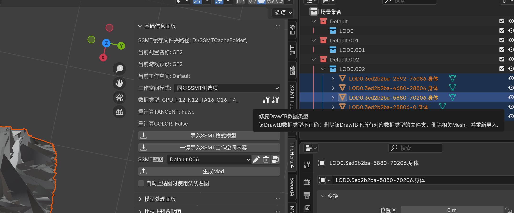
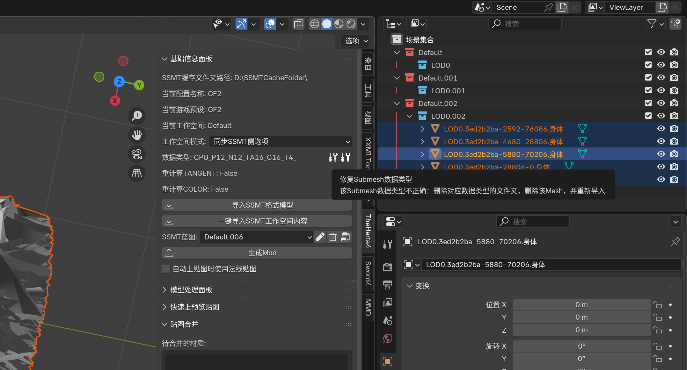
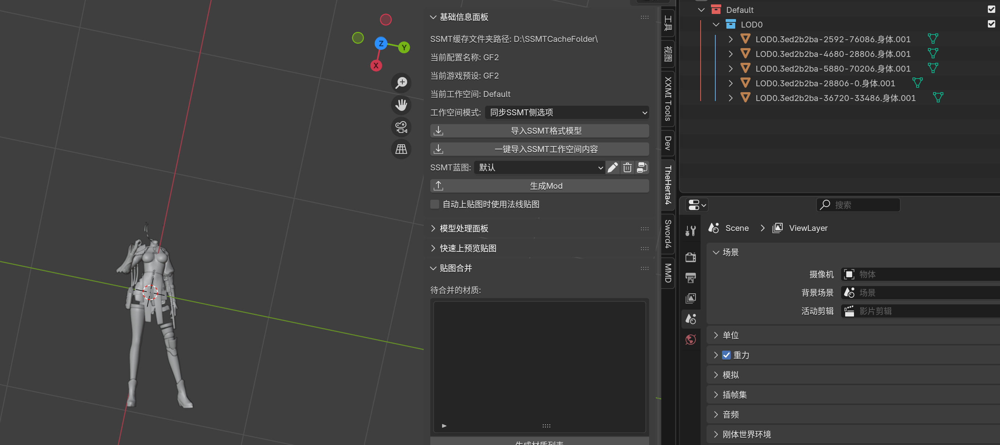
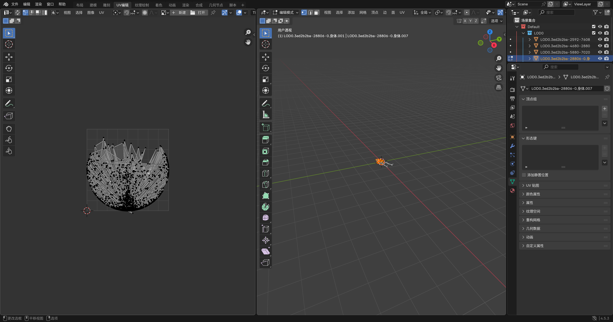
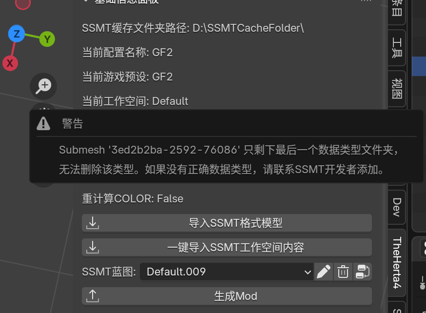

# 提取模型有多个数据类型

SSMT的提取模型方法是遍历识别每一种可能的数据类型，所以有时候可能会错误的识别到多种数据类型。

以GF2举例，提取模型后，直接导入发现模型炸了，有的时候也表现为UV炸了：

此时我们可以点击数据类型右侧的按钮，进行一键重新导入另一个正确的数据类型：

顾名思义，修复该DrawIB数据类型会统计所选物体的所有DrawIB，并将属于该DrawIB的模型全部重新导入

修复该Submesh数据类型则只会统计当前所选物体Submesh

此时我们的游戏是GF2，则整个DrawIB共享相同的数据类型（终末地是每个Submesh独立数据类型）

所以我们选中一个或多个物体，点击【修复该DrawIB数据类型】，然后可以看到重新导入了：

然后虽然模型没问题了，但是要检查UV是否正确：

发现UV有问题，再点一次【修复该DrawIB数据类型】：

发现这是最后一个数据类型了，但是你发现模型仍然有问题

到这里如果没能解决的话，就需要你将FrameAnalysis文件夹以及提取用的DrawIB发给我了，详情参考此文档：

[找不到数据类型怎么办？](/newbie/ssmt/CantFindDataType/CantFindDataType)

