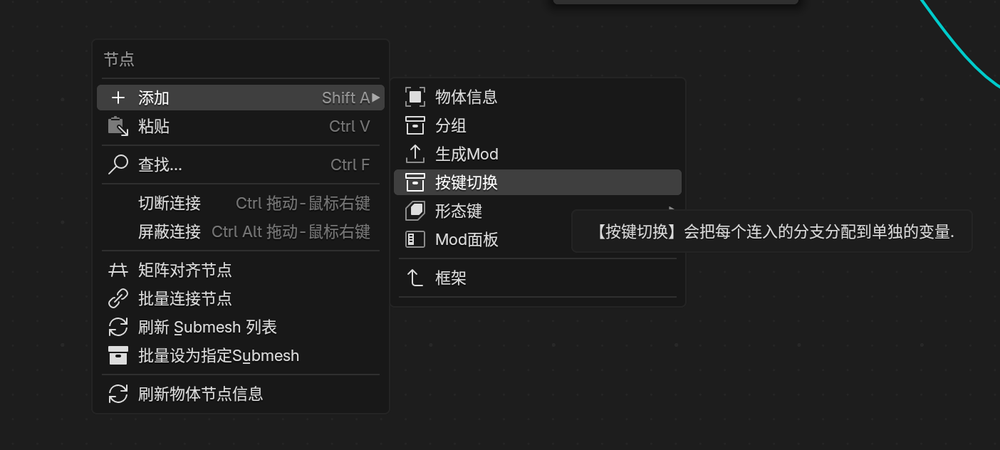
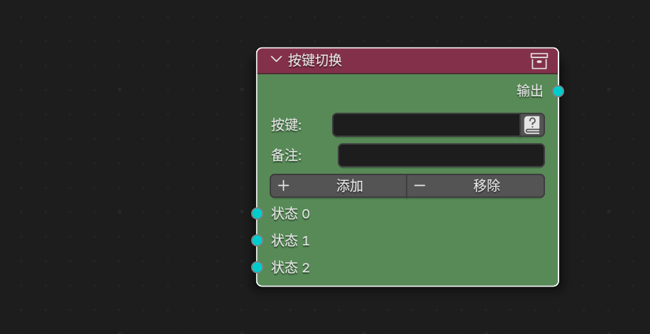
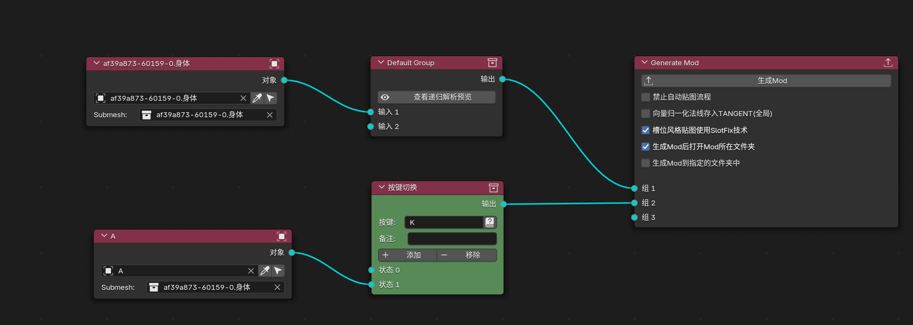
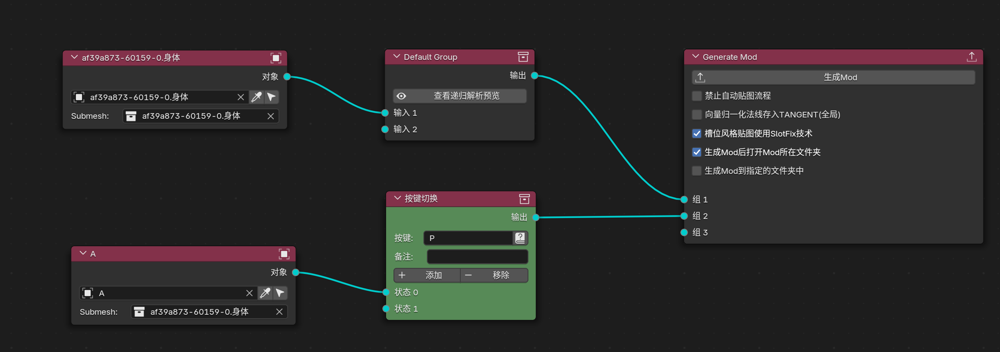
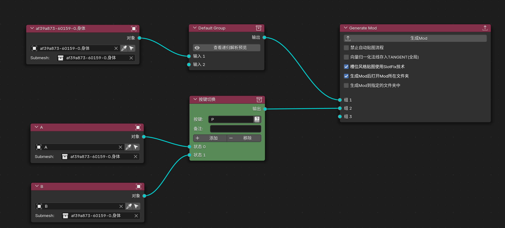
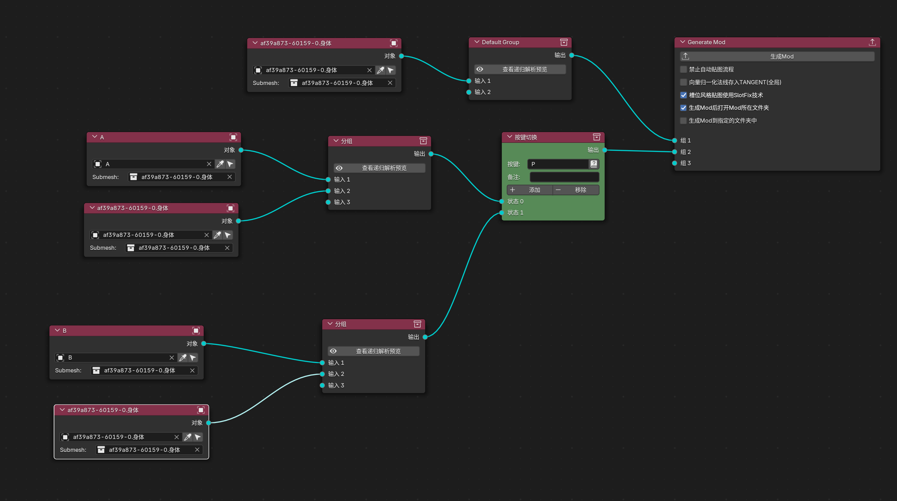

# TheHerta4分支系统

在TheHerta4中要实现Mod的按键开关和按键切换，需要右键添加 `按键切换` 蓝图节点

长这样：

添加按钮可以新增左侧`状态槽`,移除则减少`状态槽`

左侧状态，每一个状态对应一个ini中的if语句

可以看到，我们只有 `与` 逻辑，没有 `非` 逻辑，但是只要你灵活使用按键切换节点

所有的 非 逻辑需求，也都是可以使用按键切换节点实现的

> 按键切换节点可以实现 按键切换 和 按键开关 的效果，关键是要灵活使用
>
> 记得灵活使用组节点进行分组和无限嵌套，实现复杂逻辑

## 案例需求:按下按键K后才显示物体A，否则默认不显示

## 案例需求:物体A默认显示，按下按键P后关闭

## 案例需求:默认显示物体A，按下按键P后切换到B

## 案例需求: 物体A出现时,物体B不显示

将物体A和物体B放于不同的`组`中，最终连接到不同的`状态槽`即可

